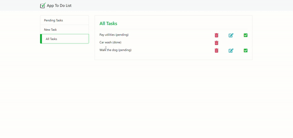

# To-Do List App
A simple PHP-based to-do list application developed as part of a challenge in the Udemy course ["Complete Web Development - 20 Courses + 20 Projects"](https://www.udemy.com/course/web-completo). This app allows users to manage tasks by adding, viewing, updating, and deleting them, with statuses for pending or completed tasks.

## Table of contents
- [Demo](#demo)
- [Features](#features)
- [Technologies Used](#technologies-used)

## Demo

## Features
 - Add new tasks with a description.
 - View all tasks, filtered by:
  - Pending tasks
  - Completed tasks
  - All tasks
 - Mark tasks as done or update them.
 - Delete tasks when no longer needed.

## Technologies Used
 - Backend: PHP (Version: 8.2.4)
 - Database: MySQL
 - Server: Apache (via XAMPP)
 - Frontend: HTML, CSS, and basic Bootstrap for styling.
